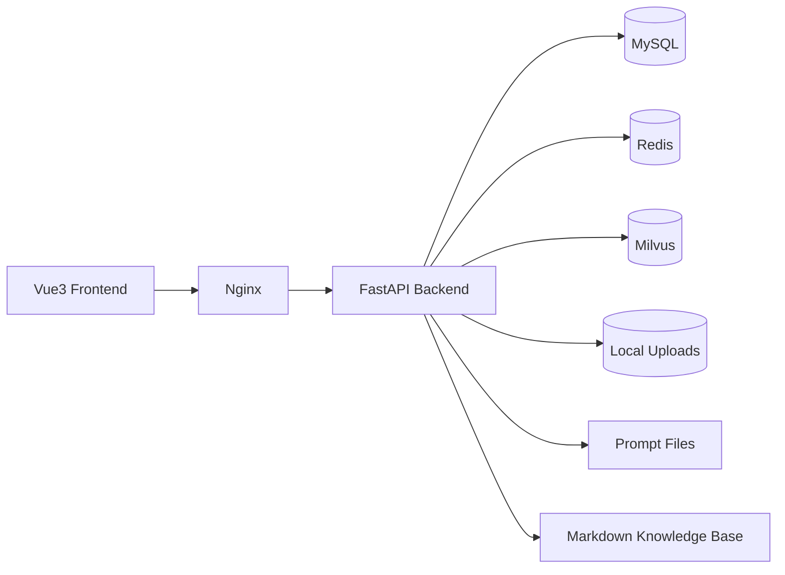

# 系统架构

```mermaid
flowchart LR
    FE[Vue3 Frontend] --> Nginx
    Nginx --> API[FastAPI Backend]
    API --> MySQL[(MySQL)]
    API --> Redis[(Redis)]
    API --> Milvus[(Milvus)]
    API --> Uploads[(Local Uploads)]
    API --> Prompts[Prompt Files]
    API --> KB[Markdown Knowledge Base]
```

## 主链路
- 用户登录后选择岗位、面试风格和答题方式。
- 上传简历并解析成结构化摘要。
- 创建面试会话后生成首题。
- 用户提交文本或语音答案。
- 系统执行检索、评分、语音分析和追问决策。
- 达到结束条件后生成结构化报告与成长建议。
